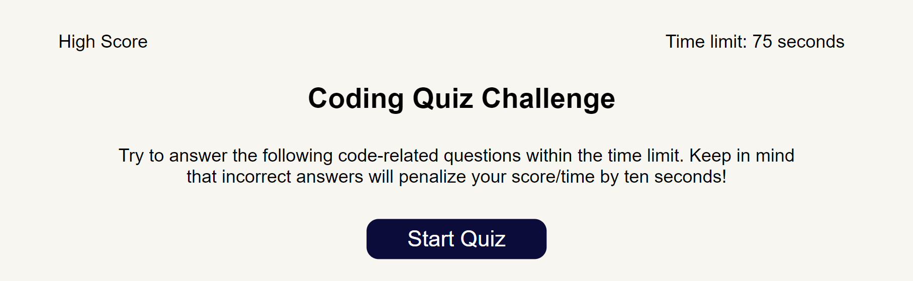

# web-API-code-quiz

## Description 
This project is to create a timed quiz on JavaScript fundamentals that stores high scores. 

## Link to deployed application 
https://jessibewu.github.io/web-API-code-quiz/

## Usage 
Below is a screenshot of the application: 

 

## Credits: 
https://courses.bootcampspot.com/

## License: 
Licensed under the MIT license.
